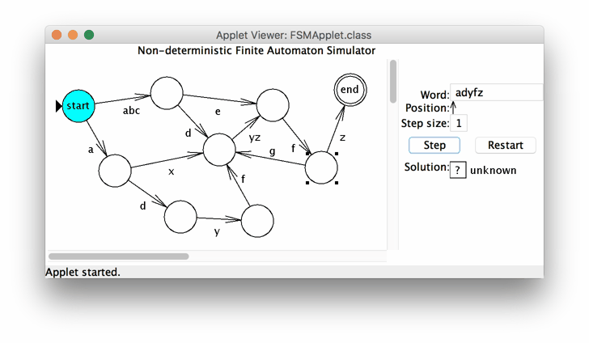

# Nondeterministic Finite Automaton Simulator

## About the project

I wanted honors credit for CS520 for the fall semester of the 1999-2000 year, so I wrote a non-deterministic finite automaton (NFA) simulator as a semester project. I designed the simulator as a Java applet so that everyone could play with it in their web browsers, and hopefully find it to be a useful learning tool for the theory of computing. Unfortunately, applets are not well supported anymore, but you can still execute the `FSMApplet` e.g. in the Eclipse IDE, after importing it via _File > Import > Existing Maven Project_.

## What is does

The simulator lets you construct an NFA, then step through its computation process on words of your choice.

## How to use it

The controls for the applet are:

* To __create a state__, hold shift and left-click an empty area.
* To __select a state__, simply click it.
* To __move a state__, click and drag it.
* To __create a transition__ from one state to another, first select the source state. Then, right-click the destination state (it should then be selected in red). Now type the characters of the transitions you would like to have from the source state to the destination state. To make an EPSILON transition, press the SPACE BAR.
* To __remove a transition__, follow the same steps as in creating a transition, but type BACKSPACE as the transition character.
* To __toggle an accept state__, hold shift and click the state.
* To __remove a state__, hold shift and right-click the state. Note that you cannot delete the start state (the state with the black triangle pointing to it), because the computation begins at this state.
* To __change a state's name__ simply select the state, then type its new name. Press backspace to delete characters from the end of the name.
* To __begin a new computation__, type a word into the __Word__ text field, then press enter.
* To __step through a computation__, click the __Step__ button.
* To __change the step increment__, type a new value into the __Step size__ text field, then press enter. Clicking the Step button will then cause the computation to proceed by that many steps at a time.
* To __restart the computation__ from the beginning of the word, click the __Restart__ button.
